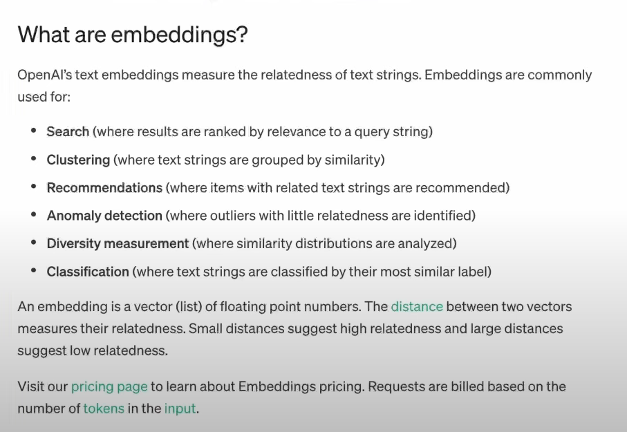
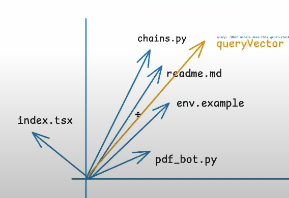

Eros - The Greek god of love and attraction
In Greek mythology, Dionysuss is the god of wine, fertility, drama, and other aspects of celebration

Number of file means number that number of token that will going to use for this project

TRPC is simlar to the express but it provides the type safty to the frontend and backend
we have to create an middleware between the backend and frontend which authenticate the user to use our api of the backend

TRPC Root main route but there are sub route like project ,post, and app many which we can use

React query for the refersh the page

AI agent

to run the ts file use
bun run [filePath]

langChain is use to work with larg LLM modules and also with unstructure data like in our case we are fetching the hole repo so this also the unstructure data right
https://www.langchain.com/
retrival augmented system

vector embedding / quertVector
its 2d space
and the vectors are closer then it means that its more similar

{

    1. first we take the summary of the files each
    2. then we embedde the summary means convert into the vector
    3. and store it in the Postgress , postgress also provides the vector embedding

    prompt is given
    1. take the input prompt and generate the  vector embedding
    2. and try to find the similarity in the files and prompt (means it will place in same space which are the files are in the space of vector )
    3. 
    4. and after  that we will get most closed or most relavent file
    5. then take those files in put it into the AI context now ai has
    6. then it can generate the Human readable (RAG)
    7. Retrieval Augmented Generation
       retrievel -> retrieve relavent documents
       augmented -> change
       generation -> generate using the LLM

}
